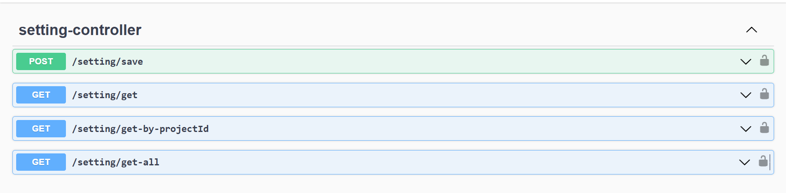
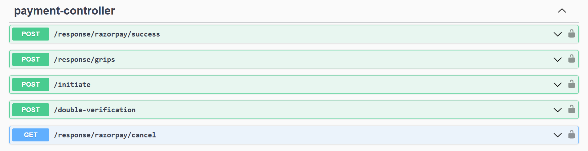
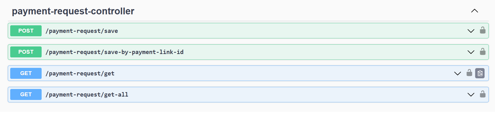
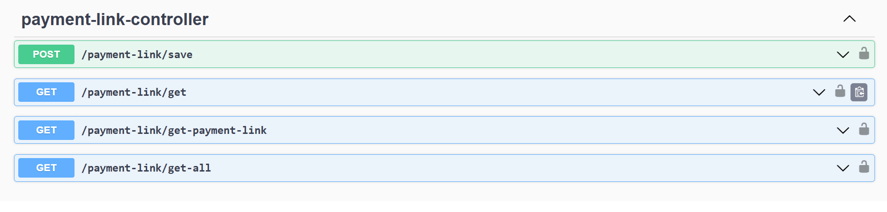
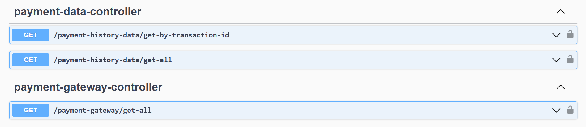

# 💳 PayGate Blend

A plug-and-play Payment Gateway Integration Module built for scalable and configurable enterprise applications. It supports seamless integration with multiple payment gateways like GRIPS 2.0, Easebuzz, and Razorpay, with minimal development effort.

## 🚀 Features

- 🔌 Plug-and-play gateway adapter module
- ⚙️ Dynamic project-based configuration using JSON metadata
- 🏗️ Built on an extendable Adapter Pattern architecture
- 🧩 Easily add new gateways with minimal code changes
- 🛡️ Clean REST API structure using Spring Boot
- 🖥️ Interactive frontend using jQuery for configuration UI

## 🛠️ Tech Stack

**Backend**:
- Java, Spring Boot
- RESTful APIs
- JSON Schema
- PostgreSQL (or compatible DB)

**Frontend**:
- HTML5, CSS3
- jQuery
- Bootstrap

**Tools & Utilities**:
- Swagger (API documentation)
- Postman (API testing)
- Git, GitHub


## 📘 API Documentation - PayGate Blend

This document outlines the major REST API controllers in the **PayGate Blend** payment gateway integration system, along with their purpose and important endpoints.

---

### 📁 1. SettingController

### 🎯 Purpose:
Handles storage and retrieval of gateway configuration settings (like keys, secrets, URLs) specific to each project.

### 🔗 Endpoints:
| Method | Endpoint | Description |
|--------|----------|-------------|
| `GET` | `/payment/setting/get-by-projectId` | Fetch saved configuration for a given project ID |
| `POST` | `/payment/setting/save` | Save a new configuration for a project |
| `GET` | `/payment/setting/get` | Fetches a configuration by project ID |
| `GET` | `/payment/setting/get-all` | Fetches all setting configuratios |

### 🖼️ Swagger Screenshot Example:


---

## 📁 2. PaymentController

### 🎯 Purpose:
Initiates payments using the appropriate gateway adapter based on saved configurations.

### 🔗 Endpoints:
| Method | Endpoint | Description |
|--------|----------|-------------|
| `POST` | `/initiate` | Initiate a payment for the selected gateway |
| `POST` | `/response/razorpay/success` | Callback handler after payment completion |
| `POST` | `/response/razorpay/cancel` | Handle user-cancelled transactions |

### 🖼️ Swagger Screenshot Example:


---

## 📁 3. PaymentRequestController

### 🎯 Purpose:
Logs and manages raw payment initiation requests for tracking and retry purposes.

### 🔗 Endpoints:
| Method | Endpoint | Description |
|--------|----------|-------------|
| `POST` | `/payment-request/save` | Save raw request metadata |
| `GET`  | `/payment-request/get-all` | Retrieve all saved payment requests |
| `GET`  | `/payment/request/get` | Retrieve details of a specific request |

### 🖼️ Swagger Screenshot Example:


---

## 📁 4. PaymentLinkController

### 🎯 Purpose:
Generate and manage one-time or recurring payment links.

### 🔗 Endpoints:
| Method | Endpoint | Description |
|--------|----------|-------------|
| `GET` | `/payment-link/get-payment-link` | Create a shareable payment link |
| `GET`  | `/payment-link/get` | Fetch payment link metadata |
| `POST`  | `/payment-link/save` | Save payment link settings |
| `GET` | `/payment-link/get-all` | Fetches all payment links |

### 🖼️ Swagger Screenshot Example:


---

## 📁 5. PaymentGatewayController

### 🎯 Purpose:
Provides information on supported gateways and their field metadata for config UI.

### 🔗 Endpoints:
| Method | Endpoint | Description |
|--------|----------|-------------|
| `GET` | `/payment-gateway/get-all` | List all supported payment gateways |
| `GET` | `/payment-history-data/get-by-transaction-id` | Fetches payment history data by transaction id |
| `GET` | `payment-history-data/get-ll` | Fetches all payment history data  |

### 🖼️ Swagger Screenshot Example:


---

## 📎 Notes

- Use **Swagger UI** at `http://localhost:8090/swagger-ui.html` to interact with and test the APIs.

---

## 🧾 Common Gateway Configuration Schema

The following configuration JSON defines the field-level metadata for all supported payment gateways. Each field includes properties like type, whether it's required, if it's a dropdown, and whether it supports key-value arrays.

### 🧮 Configuration Fields

| Field | Type | Required | Array | Key-Value | Dropdown Options |
|-------|------|----------|-------|-----------|------------------|
| action | dropdown | ✅ | ❌ | ❌ | PMT: Payment, QPMT: Quick Payment |
| depMob | user_defined | ✅ | ❌ | ❌ | — |
| dpr | system_generated | ✅ | ❌ | ❌ | — |
| paymentAmt | user_defined | ✅ | ❌ | ❌ | — |
| additionalParamDtls | user_defined | ❌ | ✅ | ✅ (`paramName` / `paramVal`) | — |
| depAddress | user_defined | ❌ | ❌ | ❌ | — |
| depEmail | user_defined | ❌ | ❌ | ❌ | — |
| depName | user_defined | ❌ | ❌ | ❌ | — |
| deptCode | user_defined | ✅ | ❌ | ❌ | — |
| depType | user_defined | ✅ | ❌ | ❌ | — |
| drn | system_generated | ✅ | ❌ | ❌ | — |
| identificationNo | system_generated | ✅ | ❌ | ❌ | — |
| onBehalfOf | user_defined | ❌ | ❌ | ❌ | — |
| periodFrom | user_defined | ✅ | ❌ | ❌ | — |
| periodTo | user_defined | ✅ | ❌ | ❌ | — |
| pmtCategory | dropdown | ✅ | ❌ | ❌ | G: Govt Payment, D: Deposit Account, L: Local Body |
| remarks | user_defined | ❌ | ❌ | ❌ | — |
| subServiceHoaDetails | user_defined | ✅ | ✅ | ✅ (`hoa` / `amt`) | — |
| svcCode | user_defined | ✅ | ❌ | ❌ | — |
| totalAmt | user_defined | ✅ | ❌ | ❌ | — |
| respUrl | system_generated | ✅ | ❌ | ❌ | — |
| src | user_defined | ✅ | ❌ | ❌ | — |
| ip | system_generated | ✅ | ❌ | ❌ | — |
| mac | system_generated | ✅ | ❌ | ❌ | — |
| srcId | user_defined | ✅ | ❌ | ❌ | — |
| sysTimeStamp | system_generated | ✅ | ❌ | ❌ | — |
| userId | user_defined | ✅ | ❌ | ❌ | — |

---

### 🧾 Sample Payload Structure (for reference):

```json
{
  "action": "PMT",
  "depMob": "9876543210",
  "dpr": "DPR123",
  "paymentAmt": "1000",
  "additionalParamDtls": [
    { "paramName": "utmSource", "paramVal": "campaign1" },
    { "paramName": "channel", "paramVal": "web" }
  ],
  "depAddress": "Kolkata",
  "depEmail": "user@example.com",
  "depName": "Pratik Shrivastava",
  "deptCode": "DEPT001",
  "depType": "Individual",
  "drn": "DRN123456",
  "identificationNo": "ID987654321",
  "onBehalfOf": "",
  "periodFrom": "2024-04-01",
  "periodTo": "2025-03-31",
  "pmtCategory": "G",
  "remarks": "Quarterly payment",
  "subServiceHoaDetails": [
    { "hoa": "HOA001", "amt": "500" },
    { "hoa": "HOA002", "amt": "500" }
  ],
  "svcCode": "SVC123",
  "totalAmt": "1000",
  "respUrl": "https://example.com/callback",
  "src": "portal",
  "ip": "192.168.1.10",
  "mac": "A1:B2:C3:D4:E5:F6",
  "srcId": "SRC123",
  "sysTimeStamp": "2025-07-07T12:00:00Z",
  "userId": "USR001"
}
```


📌 Note: All system-generated fields like dpr, drn, identificationNo, etc., should be populated internally by the backend before initiating the payment process.

